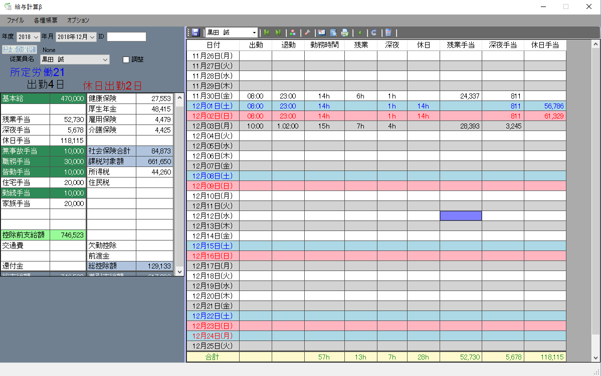
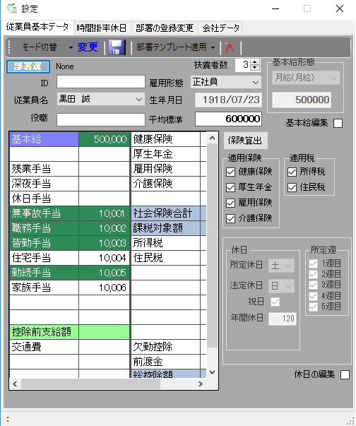
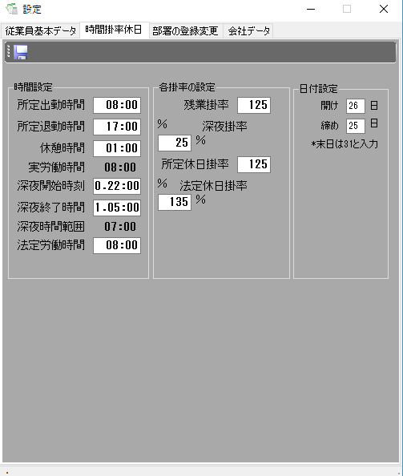
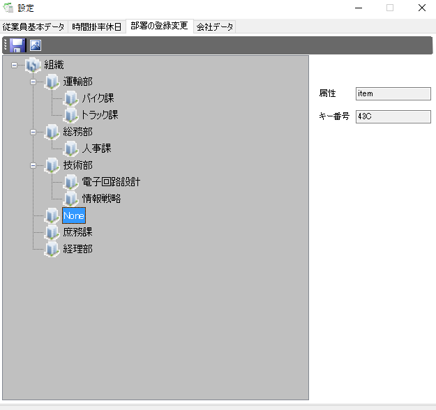
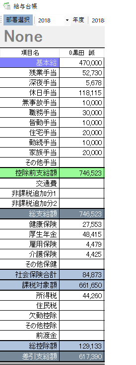
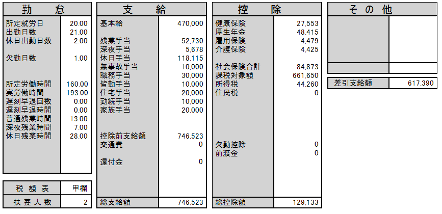

# IT業界に入る前にC#.NETで作った給与計算

### できること
- 給与計算
- 給与台帳の表示
- 出勤簿の表示
- 給与明細の印刷

### なぜ作ったのか
会社を経営していて給与の管理は自分で対応している父親から最近、給与の手動計算でミスが目立つようになったと聞き、 給与の計算ミスは信頼関係を損なう可能性があること、また、少しでも親孝行をしたいという思いもあったのがキッカケ
 
当時の自分は、実務未経験ではあるものの色々作ってはいたので少しはプログラムが書けた

### 感想(コードを読みつつ当時を振り返る)
残業代(通常残業, 深夜残業, 休日残業)をそれぞれ算出するアルゴリズムの実装がめちゃめちゃ大変だった。
この後、いくつか他言語で時間計算を実装してみて、.NETの日付APIがトップレベルで優秀だと知ることになる。
 
祝日の日を求めるアルゴリズムも自前で実装して、分けのわからない数値がいっぱい出てきて日付計算は魔境ではと感じた
 
初めて印刷機能を実装して、表示の位置調整がすこぶる面倒だと知る。印刷出来た時は感動モノだった。
 
社会保険料を求める時に自前でバイナリサーチを実装していて、当時、基本的なソートなどのアルゴリズムを勉強していたことを思い出す
 
これを作って人生で初めてと言っていいくらい、父親にめちゃめちゃ感謝された。
 
業務効率化を実現し、ミスが減り余暇が生まれ、プログラミングのすごさに感動し、IT業界を目指すキッカケになった理由の一つ。
